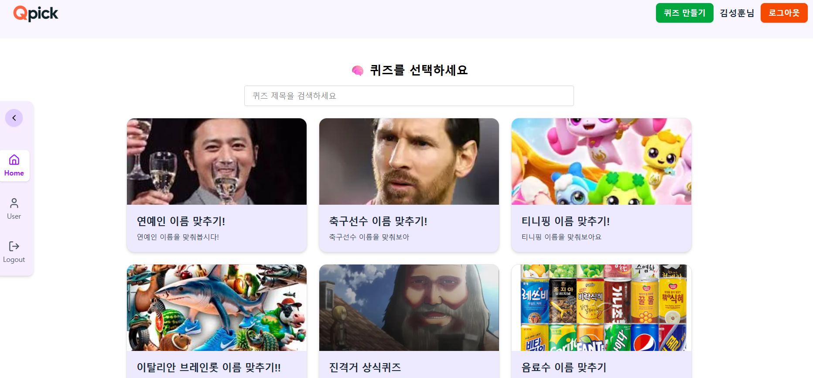
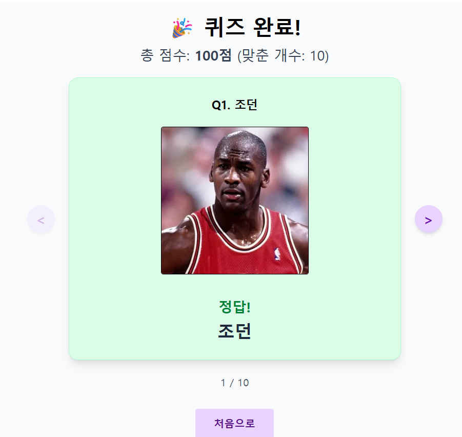
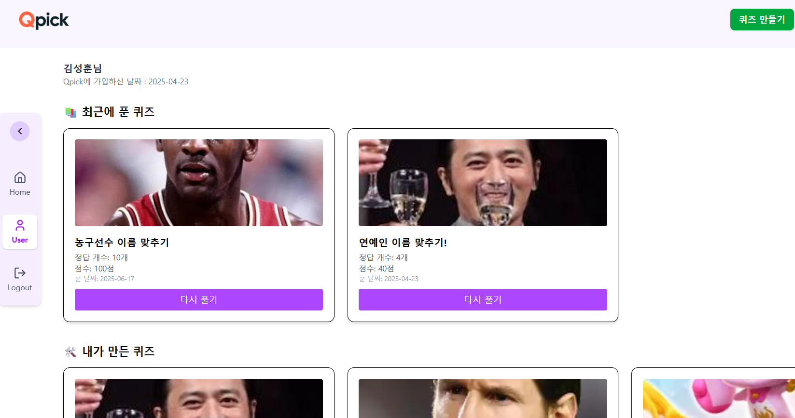

# 🎯 Qpick - 이미지 기반 퀴즈 플랫폼

**누구나 쉽게 퀴즈를 만들고, 누구나 바로 풀 수 있는 웹 서비스!**  
- 구글, 네이버, 카카오 소셜 계정만 있으면 바로 가입 가능  
- 회원은 퀴즈 생성 및 풀이 기록 저장, 비회원도 자유롭게 퀴즈 풀이 가능 🎉

---

## 🖼️ 주요 화면

### 🏠 홈 화면



- 등록된 다양한 퀴즈셋을 확인하고 바로 풀 수 있어요!
- 퀴즈 제목으로 검색도 가능합니다.

---

### ✍️ 퀴즈 만들기 - 제목 및 설명 입력


---

### 📸 퀴즈 만들기 - 문제 10개 등록


---

### ✅ 퀴즈 완료 결과 화면



---

### 👤 마이페이지 - 내가 푼 퀴즈 / 만든 퀴즈



---

## 🛠️ 기술 스택

### 🔙 Back-End
- Java 21, Spring Boot 3
- Spring Security + JWT + OAuth2
- MySQL + Spring Data JPA
- AWS S3 이미지 업로드
- Postman 기반 API 테스트

### 💻 Front-End
- React 19 + Vite
- Tailwind CSS
- Axios (withCredentials + Interceptor)
- React Router v7

---

## 🧩 주요 기능 요약

| 기능               | 설명                                                  |
|------------------|------------------------------------------------------|
| 소셜 로그인         | 구글, 네이버, 카카오 OAuth2 지원                       |
| 퀴즈 생성           | 이미지 기반 퀴즈셋 생성 (10문제 단위)                    |
| 퀴즈 풀이           | 비회원도 즉시 퀴즈 풀이 가능                             |
| 이미지 업로드       | S3 업로드 (temp/upload 구분)                            |
| 마이페이지          | 내가 만든 퀴즈 / 푼 퀴즈 확인 가능                        |
| N+1 문제 해결       | findAllById(), @EntityGraph 활용으로 성능 개선           |

---

## 🚀 퍼포먼스 최적화

### ✅ 정답 제출 N+1 문제 해결

```java
Map<Long, Quiz> quizMap = quizRepository.findAllById(ids)
    .stream().collect(toMap(Quiz::getId, Function.identity()));
```

→ `findById()` 반복 대신 `findAllById()`로 10개의 퀴즈를 한 번에 조회함

---

### ✅ Answer → Quiz → QuizSet 관계 최적화

```java
@EntityGraph(attributePaths = {"quiz", "quiz.quizSet"})
@Query("select a from Answer a where a.user.id = :userId")
List<Answer> findWithQuizSetByUserId(Long userId);
```

→ `Answer`에서 연결된 `Quiz`, `QuizSet`까지 한 번에 fetch

---

## ✅ 요약

* 비회원도 퀴즈 풀이 가능
* 소셜 로그인으로 퀴즈 생성 가능
* 직관적인 UI + 이미지 기반 구성
* S3 업로드 / JWT 인증 / OAuth2 통합
* 실전 성능 튜닝 (N+1 문제 해결)

